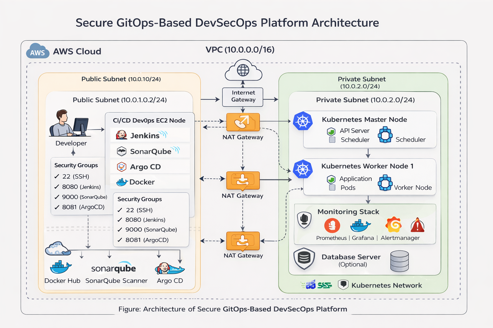
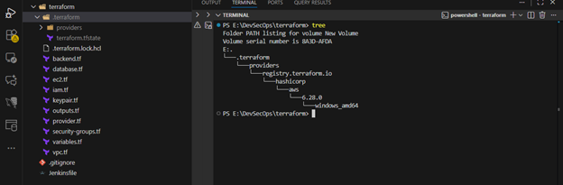
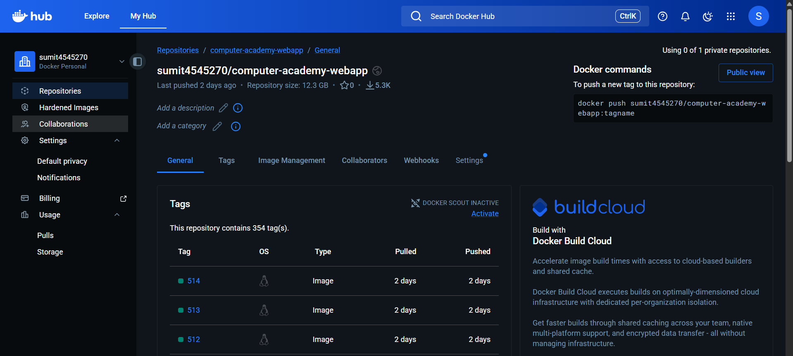
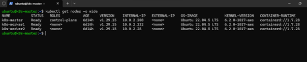
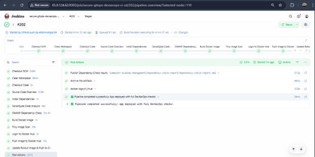
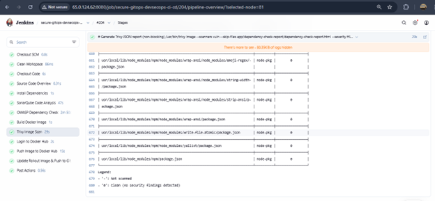
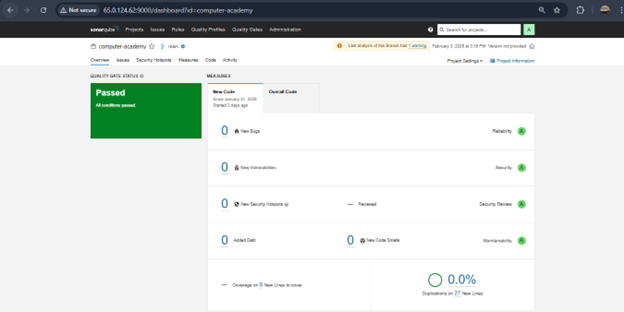
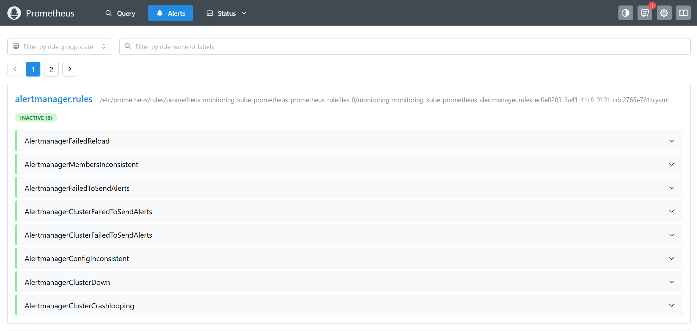
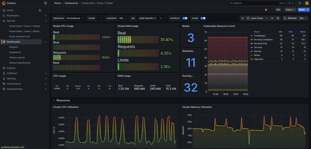
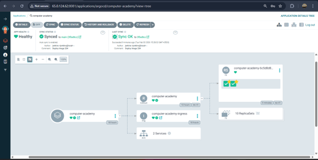

# DevSecOps Based Infra Automation for Secured Delivery & Monitoring

## Project Overview
This project demonstrates a complete **Secure GitOps-based DevSecOps pipeline**
integrating CI/CD, security scanning, monitoring, and GitOps deployment.

---

## 0️⃣ DevSecOps NetWork

  

---

## 1️⃣ Infrastructure Setup

  

---

## 2️⃣ Docker Image Build & Push (DockerHub)

  

---

## 3️⃣ Application Nodes

  

---

## 4️⃣ CI/CD Pipeline Flow

  

---

## 5️⃣ Jenkins Complete Pipeline

  

---

## 6️⃣ SonarQube Code Quality Analysis

  

---

## 7️⃣ SonarQube Vulnerability Report

  

---

## 9️⃣ Security Vulnerabilities Summary

  

---

## 9️⃣ Prometheus & Alertmanager (Slack Alerts)

  

---

## 🔟 Grafana Monitoring Dashboard

  

---

## 1️⃣1️⃣ ArgoCD GitOps Deployment

  

---

## 📌 Conclusion
This project implements an end-to-end **DevSecOps pipeline**
with automated security checks, GitOps-based deployments,
and real-time monitoring & alerting.

